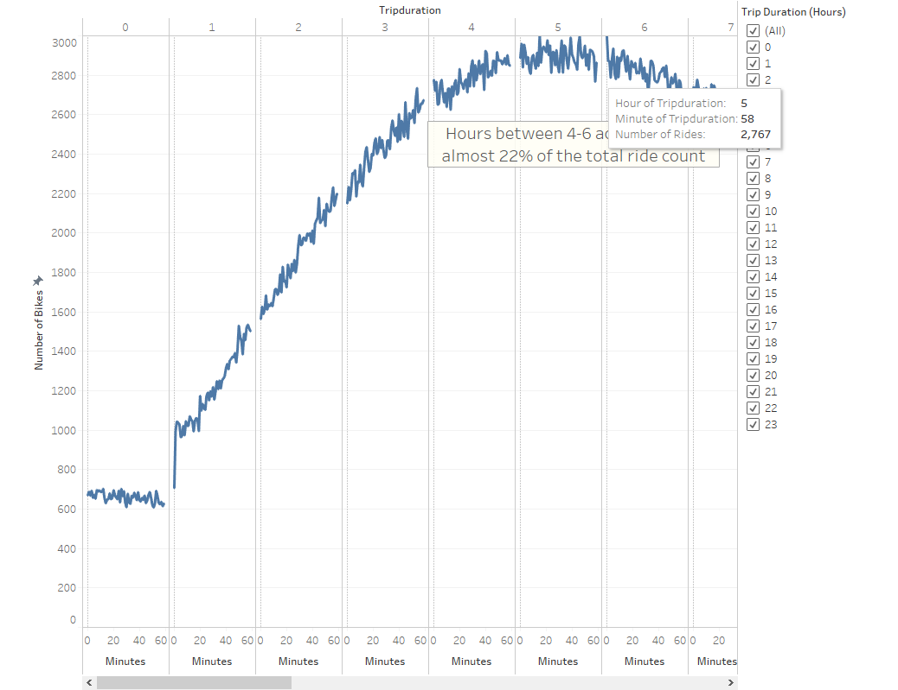
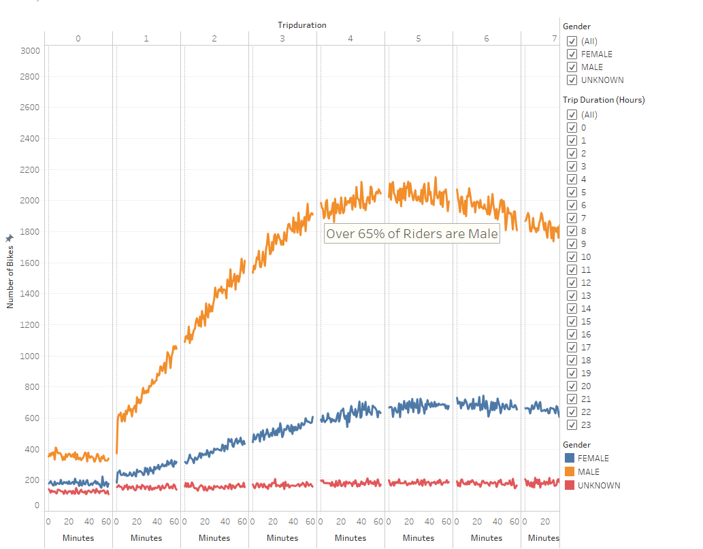
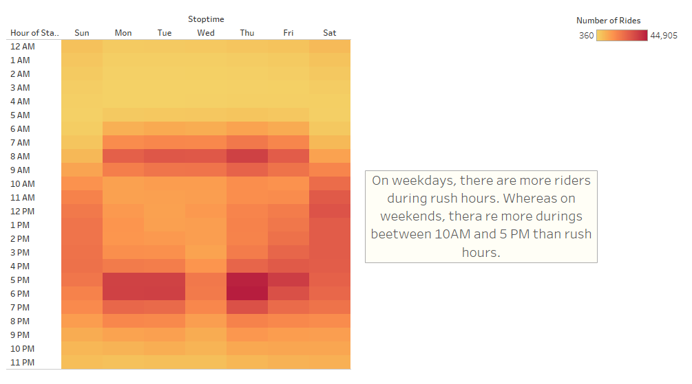
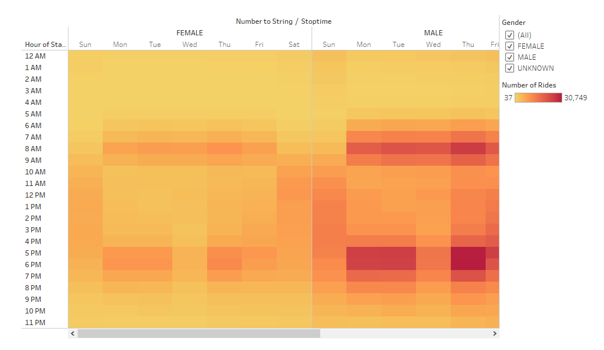
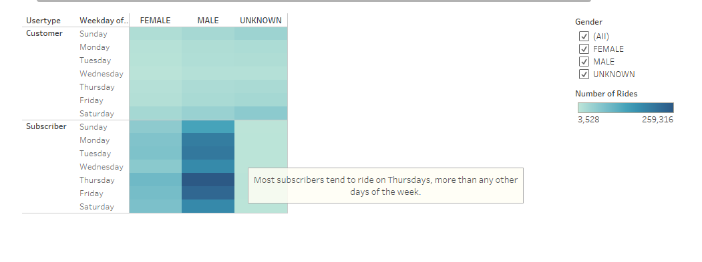
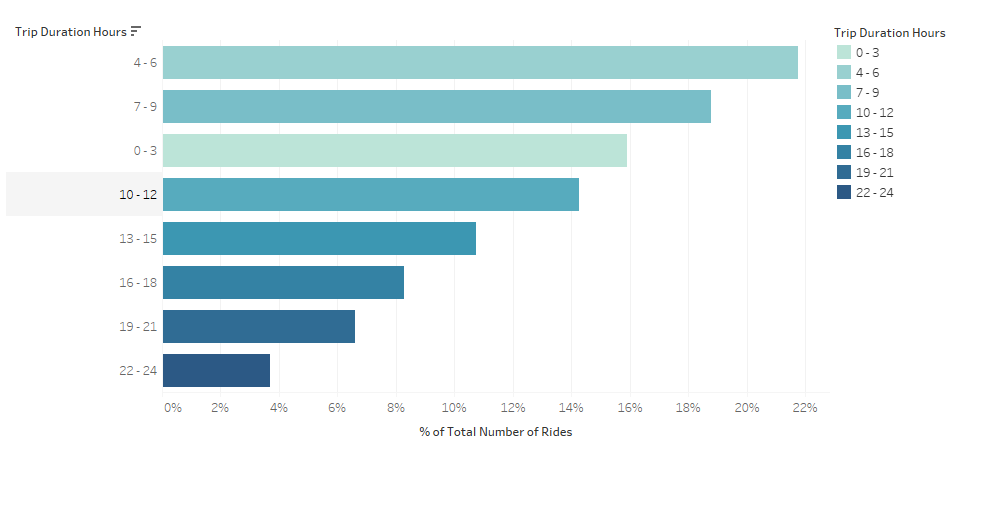
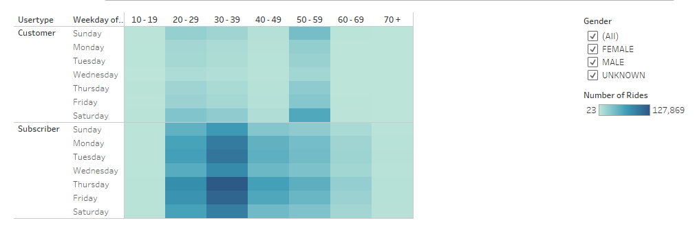

# bikesharing

## Project Overview
In this module we'll be using Tableau to visualize bike-sharing data of New York city. 

## Results
[link to dashboard](https://public.tableau.com/views/Module14Challenge_16011538858000/CitiBikeStory?:language=en&:display_count=y&publish=yes&:origin=viz_share_link)

 
5 hour trip duration was the most popular. Hours between 4-6 accounted for almost 22% of the total ride count.
 
Over 65% of the riders are male.
 
On weekdays, there are more riders during rush hours. Whereas on weekends, there are more riders beetween 10AM and 5 PM. 
 
There are no clear differences between the genders. On weekdays, there are more riders during rush hours. Whereas on weekends, there are more riders beetween 10AM and 5 PM. 
 
Most subscribers tend to ride on Thursdays, more than any other days of the week.

## Summary
Our analysis illustrates that most of our riders are male with 65%.  Thursdays have more riders than any other days.  On weekdays the most popular time is during rush hours and on weekends there are more riders beetween 10AM and 5 PM. 

The following 2 vizes were added to provide additional analysis on the  bike-sharing data: 
 
Trip duration hours between 4-6 accounted for almost 22% of total number of rides in New York city.
 
Customers tend to be between ages 50-59 while subscribers tend to be between ages of 30-39.
